# 🛠️ เจาะลึกการทำงานของระบบ (อธิบายรายไฟล์)

สวัสดีครับ! ไฟล์นี้ทำหน้าที่อธิบาย **"กลไกข้างใน"** ของโปรเจกต์นี้ทั้งหมด โดยใช้ภาษาไทยแบบกันเอง เพื่อให้คุณเข้าใจว่าแต่ละไฟล์ทำหน้าที่อะไรและทำงานร่วมกันอย่างไรครับ

---

## 🏗️ โครงสร้างสำคัญ (The Core)

### 1. [run.py]

**หน้าที่:** "ปุ่มสตาร์ทรถ"
ใช้สำหรับสั่งรันโปรแกรม เพื่อเปิดเว็บไซต์จำลอง (Web Server) ขึ้นมาเป่าประกาศให้ Browser รู้ว่าเราพร้อมทำงานแล้ว

### 2. [app/**init**.py]

**หน้าที่:** "ผู้จัดการโครงการ"
ทำหน้าที่รวบรวมชิ้นส่วนทุกอย่างมารวมกัน ทั้งฐานข้อมูล, ระบบ Login, และเส้นทางเดินเว็บ (Routes) พร้อมทั้งคอยคัดกรองว่า "ถ้ายังไม่ Login ห้ามเข้าหน้าข้างในนะ"

### 3. [app/config.py]

**หน้าที่:** "สมุดจดตั้งค่า"
เก็บค่าสำคัญๆ เช่น รหัสผ่านฐานข้อมูล MySQL หรือถ้าคุณไม่มี MySQL มันจะแอบเปลี่ยนไปใช้ SQLite ให้โดยอัตโนมัติเพื่อให้โปรแกรมไม่พังครับ

---

## 💾 ระบบข้อมูล (Models & Utils)

### โฟลเดอร์ `app/models/`

คือการนิยามว่าเราจะเก็บข้อมูลอะไรบ้าง (เปรียบเหมือนเป็นหัวคอลัมน์ใน Excel):

- **[user.py]:** ข้อมูลพนักงานและแอดมิน (ใครเป็นใคร, ใครใหญ่กว่าใคร)
- **[part.py]:** สเตตัสอะไหล่ (มีกี่ชิ้น, SKU ไหน)
- **[production_plan.py]:** แผนการผลิตของวันนั้นๆ
- **[bom.py]:** "สูตรอาหาร" ของโรงงาน ว่างาน 1 ชิ้น ต้องใช้อะไหล่อะไรบ้างอย่างละกี่ตัว
- **[consumption.py]:** บันทึกการกินอะไหล่จริง และยอดของเสีย (Scrap)

### โฟลเดอร์ `app/utils/`

คือ "เครื่องมือช่าง" ที่คอยสนับสนุน:

- **[db.py]:** ตัวเชื่อมต่อสายเคเบิลไปหาฐานข้อมูล
- **[decorators.py]:** "ยามเฝ้าหน้าประตู" คอยเช็คว่า "ห้าม Operator เข้าหน้า Admin นะ"

---

## 🛣️ ระบบควบคุมการทำงาน (Routes)

- **[auth.py]:** ดูแลเรื่องการเข้าบ้าน (Login/Logout)
- **[admin.py]:** สมองกลของแอดมิน ทั้งการดู Dashboard สวยๆ, การ Import Excel, และการดึงรายงาน
- **[operator.py]:** หน้าจอที่ออกแบบมาให้คนหน้างานใช้งานง่ายๆ กดเริ่มงาน-จบงานได้ในปุ่มเดียว

---

## 📊 ผังความสัมพันธ์ข้อมูล (ER Diagram)

เพื่อให้เห็นภาพว่าแต่ละตารางเชื่อมโยงกันอย่างไร ดูแผนผังด้านล่างนี้ได้เลยครับ:

```mermaid
erDiagram
    USERS {
        int id PK
        string username
        string email
        string role
    }
    PARTS {
        int id PK
        string name
        string sku
        int current_stock
        int min_stock_level
    }
    STATIONS {
        int id PK
        string name
    }
    PRODUCTION_PLANS {
        int id PK
        int station_id FK
        string project_title
        date target_date
        int planned_qty
        string status
    }
    BOM {
        int id PK
        int plan_id FK
        int part_id FK
        int quantity_required
    }
    CONSUMPTIONS {
        int id PK
        int station_id FK
        int plan_id FK
        int part_id FK
        int quantity_used
        int scrap_qty
        datetime timestamp
    }
    STOCK_HISTORY {
        int id PK
        int part_id FK
        int change_qty
        string reason
        datetime timestamp
    }

    STATIONS ||--o{ PRODUCTION_PLANS : "กำหนดจุดผลิต"
    STATIONS ||--o{ CONSUMPTIONS : "บันทึกที่จุดนี้"
    PRODUCTION_PLANS ||--o{ BOM : "มีสูตรการผลิต"
    PRODUCTION_PLANS ||--o{ CONSUMPTIONS : "มียอดใช้จริง"
    PARTS ||--o{ BOM : "เป็นส่วนประกอบ"
    PARTS ||--o{ CONSUMPTIONS : "ถูกใช้งาน"
    PARTS ||--o{ STOCK_HISTORY : "มีประวัติสต็อก"
```

---

## 🎨 หน้าตาที่เราเห็น (Templates)

เราใช้ระบบ **Template Inheritance** (การสืบทอดโครงสร้าง):

- **[base_admin.html]:** โครงร่างหลักที่มีเมนูข้างซ้ายและส่วนหัวของแอดมิน
- **[base_operator.html]s:** โครงร่างที่เน้นปุ่มใหญ่ๆ เพื่อให้พนักงานกดได้ง่ายผ่านหน้าจอกลางโรงงาน
- **ส่วนอื่นๆ:** จะเป็นเนื้อหาเฉพาะหน้า เช่น ตารางข้อมูล หรือกราฟ ซึ่งเราจะเอาไป "เสียบ" ในช่องว่างของไฟล์ base ครับ

---

## ⚡ สรุปเครื่องมือเสริมที่ใช้

- **Flask-SQLAlchemy:** ช่วยเราคุยกับฐานข้อมูลด้วยภาษา Python ที่อ่านออกง่าย
- **Pandas:** ใช้ตอนเราอัปโหลดไฟล์ "ยอดผลิต" จาก Excel เข้าระบบ
- **Chart.js:** ใช้ตอนวาด "กราฟยอดผลิต" ในหน้า Dashboard ของแอดมินครับ

---

**💡 เคล็ดลับ:** หากคุณเปิดดูไฟล์โค้ดจริงๆ ผมได้แอบใส่ **คอมเมนต์ภาษาไทย** ไว้ที่บรรทัดแรกๆ ของทุกไฟล์แล้วครับ เพื่อให้คุณอ่านในโค้ดไปพร้อมๆ กับเข้าใจหน้าที่ของมันได้ทันที!
